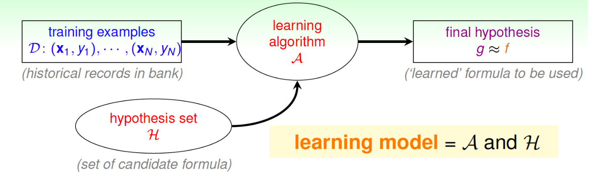

# Machine Learning
# 8/26

Missed Class

# 8/28
## Machine Learning on Eduction 
What we might see.
> Data: Students records on quizzes on a Math tutoring system
> Skill: Predict whether a student can give a correct answer to another quiz question

## ML on Entertainment:
- Pattern:
    - Rating <-- Viewer/movie factors
- Learning:
    - Known Rating
    -> Learned Factors
    -> Unknown rating predictions

From a consumer's actions on our application, we can infer what they could enjoy based on the actions they've chosen. 

For example:
> - A Streaming Service that displays movies, we can show them movies that they enjoyed

## Components of Learning:

Based on an individual's given information, the "unknown pattern" that can be inferred could be that they are a great consumer to borrow money

## Formalize the Learning Problem

- input: x is an element of X (customer application)
- output: y is an element of Y (good/bad after credit card)
- unknown pattern to be learned <-> target function:
    - f: X --> Y (ideal credit approval formula)
- data <-> training examples: D = {(x1, y1), (x2, y2), ... (xn, yn)} (historical records in bank)
- hypothesis <-> skill with hopefully good performance
    - g: X--> y (learned formula to be used)

In a nutshell
(xn, yn) <- f -> ML -> G
It takes information from the training data from "f" which goes into our ML app and outputs G

## The Learning Flow

unknown target function f: X--> y
training examples D: (x1, y1), ... (xn, yn) 
learning algorith A 
hypothesis set g = f (learned formula to be used)
f -> D -> A -> g/f
There's an additional factor called "hypothsis set" G that constains the set of candidate formula. This also goes into the learning algorithm.

## The Full Picture of ML

Machine learning uses data to compute hypothesis g that approximates the target F

# ML & DM

**Machine learning**:
> Uses data to compute hypothesis g that approximate target f

**Data mining**:
> Uses (huge) amounts of data to **find property** that is interesting

**Artificial Intelligence**:
> Computes **something that shows intelligent behavior**

**Statistics**:
> Uses data to make an inference about the unknown

G is an inference outsome; f is something unknown-- statistics can be used to achieve ML

## Types of Learning

- Learnin w/ different output space Y
- Learning w/ different data label Yn
- Learning w/ different input space X
- Learning w/ different protocol f => (xn, yn)

## Learning with different output spaces:
- Binary classification (0 or 1)
- Multiclass Classification (multiple classes to choose from)
- Regression (predice a value in a range)
- Structured Learning 
- Generative Learning

Multiclass Example:
- Written digits => 0, 1, .. 9
- Pictures => Apples, Oranges
- Emails => Spam

Regression Ex:
- Company data => stock price (ehhh)
- Climate Data => Temperature

Structured Learning Example: (more popular in bio)
- sentence => structure (class of each word)
- protein data => protein folding
- speech data => speech parse tree

Generative Learning:
Before our x and y would be different, but now they are of the same space. Given a piece of writing, you can output an altered version of the writing. 

- Binary classificaion: Y = {-1, +1}
- Multiclass Classification: y = {1, 2, ... K}
- Regression: Y = R
- Structured learning: y = structures

> **Core tools: binary classification & regression (focus of the class)**

## Superised Learning:
We feed the ML application the correct answer.
- Every xn comes with a corresponding yn

## Semi-Supervised Learning:
Some of our data points are labeled with the correct information, while some aren't

## Weakly Supervised:
The labeling on our data, are very inaccurate/ not precise. 

## Unsupervised Learning:
Diverse, with possibly very different performance goals

Unsupervised multiclass classification <-> clusering

## Reinforcement Learning
- We reward the machine, if it does the correct decision, enforcing a positive feedback loop.

### Mini-Summary
- Supervised: All yn (expensive)
- Unsupervised; No yn
- Semi-supervsed: Some yn
- Reinforcement: Implicit yn by goodness
.. and more!!

## Learning with a Different Input Space X
- Concrete features
- Raw features
- 

## Concrete Features:
- Confirmed information about the data. Therefore there's a lot more connections we can create with these confirmed information. 

## Raw Features:
- Unprocessed data, with every x, we have a significant amount of y. 

## More on Concrete Features:
- **(size, mass)** for coin classification
- **customer info** for credit approval
- **patient info** for cancer diagnosis
- often including 'human intelligence' on the learning 

## Abstract Features:
Implicit features that give us more info about our customer/data. 
**(Movie Recommendation is an example)**

## Learning with Different Protocol f=> (xn, yn)
- Batch Learning
- Sequential (online) learning
- Active learning

## Batch Learning
- Batch of (exmail, spam?) => spam filter
- Batch of (patient, cancer) => cancer classifier

## Active Learning:
- Selectively chooses it's inputs that work better with itself. 

