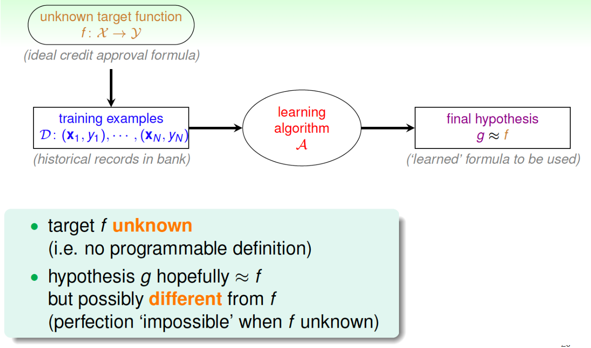
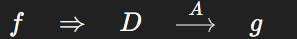

# Machine Learning
# 8/26

Missed Class

# 8/28
# Machine Learning
What is **Machine Learning?**
- **Machine Learning (ML)** is the study of algorithms that learn patterns from data to make predictions or decisions without being explicitly programmed
    - **Goal**: Learn an unknown target function f: X --> Y from data
    - **Key Idea**: Use training data to approximate _f_ with a hypothesis _g_

## Real World Applications of ML
- **Education**: Predicting student performances on quizzes
- **Entertainment**: Movie/music recommendation systems
- **Finance**: Credit approval or fraud detection

## Formalizing the Learning Problem
- **Input Space (X)**: Features or data points (e.g., customer application)
- **Output Space (Y)**: Labels or predictions (e.g., approved/not approved)
- **Target function (f)**: The "true" mapping f: **X --> Y**
- **Training data (D)**: Historical examples D = {(x1, y1), ... (xn, yn)}
- **Hypothesis (g)**: Learned function g: **X --> Y** that approximates _f_
- **Hypothesis set (G)**: Set of all candidate functions the algorithm can choose from
- **Learning Algorithm(A)**: Processes that select the "best" _g_ ∈ G given data

## Flow

## Macine Learning vs Related Fields
- **Macine Learning**: Approximates unknown function from data
- **Data Mining**: Finds interesting or novel patterns in large datasets
- **Artificial Intelligence (AI)**: Broader goal of stimulating intelligent behavior
- **Statistics**: Focuses on inferences about the unknown from data. ML borrows heavily from it.

## Types of Learning (by Output Space)
- **Binary Classification**: Output are in two classes (e.g., spam vs not spam)
- **Multiclass Classification**: Output is one of many classes (digital recognition 0 -9)
- **Regression**: Output is a continous value (stock price, temperature)
- **Structured Learning**: Output is structured data (parsing a sentence, protein folding (bio term))
- **Generative Learning**: Learn a  distribution of data to generate new samples (e.g., text generation, image generation synthesis)

Core Focus for the class are **Binary Classification & Regression**

## Types of Learning (by Data Labeling)
- **Supervised Learning**: Every x has a corresponding y label
- **Semi-Supervised Learning**: Some data are labeled, some are not
- **Weakly-Supervised Learning**: Labels exist but may be noisy or imprecise
- **Unsupervised Learning**: No labels, algorithms finds hidden structure (e.g., clustering)
- **Reinforcement Learning**: Learns by interacting with an environment, rewarded for good decisions

## Mini-Summary: 
- **Supervised** = All labels are available (expensive)
- **Semi-supervised** = Some labels
- **Unsupervised** = No labels
- **Reinforcement** = Feedback via rewards

## Types of Learning (by Input Space X)
- **Concrete Features**: Verified, interpretable inputs
    - Ex: Patient's age, blood test results, => cancer diagnosis
- **Raw Features**: Direct unprocessed data
    - Ex: Pixels in an image => digit classification
- **Abstract Features**: Latent properties discovered automatically
    - Ex: Hidden "user preferences" in a recommender system

## Types of Learning (by Protocol)
- **Batch Learning**: Learns from a full dataset at once
- **Sequential (Online) Learning**: Learns incrementally as new data arrives
- **Active Learning**: Algorithm chooses which examples it wants labeled to improve faster

## Key Insights
- Machine learning is about **approximating** patterns that humans often cannot formalize
- The **quality of data** (features, labeling, representation) matters as much as the algorithm
- Different types of learning exist based on **outputs, labels, inputs, and protocols**  

## 9/2 Linear Algebra Review

1) **Vectors**
    - Just ordered lists of numbers (like points or arrows)
    - Ex: [3,5,7]
    - **Use in Machine Learning**: Stores features (like age, height, weight)

    - **Key Idea**:
    - **Lenght/Magnitude**: how "long" the arrow is
    - **Direction**: Where it points
    - **Operations**: Add, subtract, scale (stretch/shrink)

2) **Matrices**
    - Grid of numbers (rows x cols)
    - Ex: [1 2]
          [3 4]
    - **Use in Machine Learning**: Store datasets (rows = samples, columns = features)
    - **Key Ideas**:
    - Multiplying by a vector = transforming it (rotation, scaling, etc)
    - Matrix multiplication is **not** commutative (AB != BA)

3) **Dot Product**
    - Multiply corresponding entries of two vectors and sum them
    - Ex: [1,2] * [3,4] = 1 * 3 + 2 * 4 = 11
    - **Use in Machine Learning**: Measures similarity (cosine similarity)

4) **Matrix-Vector Multiplication**
    - Applies a transformation to a vector
    - Ex: Rotating or scaling an input
    - **Use in Machine Learning**: Weights x input in neural networks

5) **Linear Transformation**
    - Rules that move/transform vectors in space
    - Scaling, rotating, projection
    - **Use in Machine Learning**: Feature scaling, dimensionality reduction

6) **Determinant** 
    - A single numbers from a square matrix
    - Tells you if a transformation keeps area/volume or squishes everything into a flat line
    - **Use in Machine Learning**: Inverse matrices, checking if equations have unique solutions

7) **Inverse of a Matrix**
    - The "undo" of a transformation
    - If A is the transformation, A^-1 undoes it.
    - **Use in Machine Learning**: Solving linear systems (like regression)

8) **Eigenvalues & Eigenvectors**
    - **Eigenvector**: A direction that doesn't change when transformed 
    - **Eigenvalue**: How much it's stretched/shrunk
    - **Use in Machine Learning**: PCA (Principle Component Analysis) for dimensionality reduction

9) **Norms**
    - Measure of vector size
    - **L1 Norm**: Sum of absolute values
    - **L2 Norm**: Square root of sum of squares (Euclidean distance)
    - **Use in Machine Learning**: Regularization (Lasso = L1, Ridge = L2)

10) **Projections**
    - Dropping a vector onto another vector line
    - Like casting a shadow
    - **Use in Machine Learning**: Regression lines, reducing dimensions

11) **Orthogonality**
    - **Two vectors are orthogonal if their dot product = 0 (perpendicular)**
    - **Use in Machine Learning**: Helps separate independent features

## Core Takeaway:
- **Vectors** = data/features
- **Matrices** = datasets/transformations
- **Dot Product, Norms & Projection** = measuring similarity & distances
- **Eigenvalues/Eigenvectors** = finding important patterns
- These concepts power regression, PCA, neural nets, and almost every Machine Learning Model

# 9/4 Stats Review

1) **Descriptive Statistics** (Summarizing Data)
    - **Mean (average)**: Central value
    - **Median**: Middle value (helps when data has outliers)
    - **Mode**: Most common value
    - **Variance & Standard Deviation**: How spread out the data is
    - **Percentiles/Quartiles**: Breaks data into chunks (e., 25%, 50%, 75%)
    - **Why it matters in Machine Learning**: It helps you understand your dataset, spot skew/outliers, and compare features

2) **Probabilty Basics**
    - **Probability (P)** : Likelihood of an event (between 0 and 1)
    - **Independent Events**: Flipping 2 coins => outcomes don't affect each other
    - **Conditional Probability**: P(A|B) => probability of A given B happened 
    - **Bayes' Theorem**: Updates probability when new evidence appears
    - **Why It Matters in Machine Learning**: Probability drives **models like Naive Baiyes, Bayesian inference, and uncertainty estimation**

3) **Random Variables & Distributions**
    - **Random Variable**: Assigns numbers to outcomes of random events
    - **Discrete Distributions**: Countable values (dice rolls, categories)
    - **Continous Distribution**: Infinite values (height, weight)
    - **Key Distributions in Machine Learning**
    - **Uniform**: Everything is equally likely
    - **Normal (Gaussian)**: Bell curve -- shows up everywhere in Machine Leaning (errors, weights)
    - **Binomial**: Success/failures trials (coin flips)
    - **Poisson**: Rare event counts (web hits/minute)
    - **Exponential**: Time between events
    - **Why It Matters in Machine Learning**: Many algorithms assume **data follows a distribution** (e.g., regression assumes normality)

4) **Correlation & Covariance**
    - **Correlation (r)**: How strongly two variables are related (-1 to +1) 
    - **Covariance**: Similar, but scale-dependent
        - **Positive** => move together
        - **Negative** => move opposite
    - **Why It Matters in Machine Learning**: Used for **feature selection, PCA (dimensionality reduction), multicollinearity checks**

5) Statistical Inference
    - **Population vs Sample**: Can't measure everyone => use a subset
    - **Estimation**:
        - **Point Estimate** => single guess (mean)
        - **Confidence Interval** => range we're confident contains the truth
    - **Hypothesis Testing**
        - **Null Hypothesis (H0)**: "No effect"
        - **Alternative (H1)**: There is an effect
        - **p-value** => probability result happened by chance
    - **Why It Matters in Machine Learning**: It helps you **validate models, compare algorithms, and avoid false conclusions**

6) **Regression Basics**
    - **Linear Regression**: Fits a line to predict outcomes
    - **Logistic Regression**: Predcits probability of categories (yes/no)
    - **Why It Matters in Machine Learning**: Foundation of **supervised learning**

7) **Sampling Methods & Bias**
    - **Random Sampling**: Everyone has equal chance
    - **Stratified Sampling**: Ensures representation of groups
    - **Bias**: Systematic error (bad sample, bad measurement)
    - **Why It Matters in Machine Learning**: Ensures **datasets are fair and representitive** => otherwise, models fails in real-world applications

## Mini-Summary
- **Descriptive Statistics** => "What's in my data?"
- **Probability** => "How likely is this event?"
- **Distributions** => "How does my data behave?"
- **Inference** => "Can I trust this conclusion?"
- **Regression** => "Can I predict outcomes?"